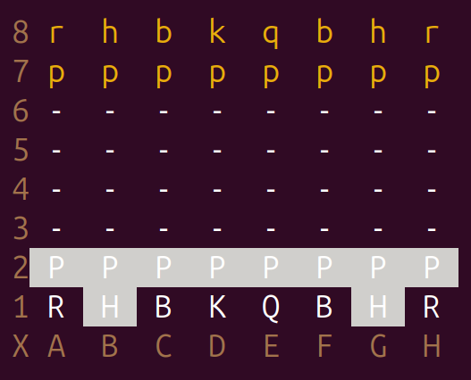
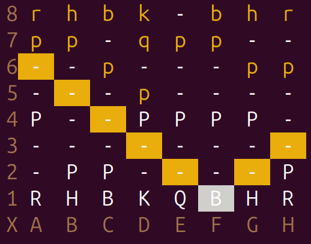
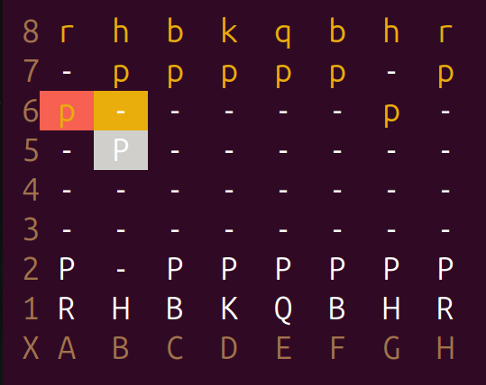

# Chess Game (C# .NET 8)

A fully functional **Chess Game** written in **C#** using **.NET 8.0**, featuring an intuitive **terminal interface with colored visual cues** to guide gameplay.

---

## Terminal Interface & Visual System

The game renders a full chessboard directly in the terminal with clear and intuitive colors.

### Board Rendering

Below is an example of the board layout shown when the game starts:



### Color Meaning

The color scheme is designed to make moves and piece interactions easy to understand:

#### **White Pieces**

* Rendered in **bright white**.

#### **Black Pieces**

* Rendered in **dark yellow**.

**Possible** **Moves**

* Rendered in gray background

#### **Possible Moves peace selected**

* Highlighted with a **yellow background**.
* These represent all squares where the selected piece *can legally move*.

Example:



#### **Capture Moves**

* Squares where your piece can both *move and capture an enemy piece* are marked with a **red background**.

Example:



#### **Piece Selection Highlight**

* Your currently selected piece is displayed with a **gray background**.

Together, these visual effects create a clear and beginner‑friendly gameplay experience entirely inside the terminal.

---

## ♟️ Features

* Full implementation of standard chess rules
* Move validation for all pieces
* Check and checkmate detection
* Interactive terminal UI with intuitive visuals
* Precompiled linux‑x64 binary included (no .NET required to run)

---

## Running code:

### Running From Source

**If you have already installed the .NET 8 SDK:**

From the project root (/Chess-Game):

```bash
dotnet run
```

### Requirements

If you want to run the project from source, you must have:

#### **.NET 8.0 SDK**

Download at: [https://dotnet.microsoft.com/en-us/download/dotnet/8.0](https://dotnet.microsoft.com/en-us/download/dotnet/8.0)

You can verify SDK installation with:

```bash
dotnet --version
```

You can also List all installed SDKs with:

```bash
dotnet --list-sdks
```

Example output:

```bash
8.0.121 [/usr/lib/dotnet/sdk]
```

If it doesn’t appear, install the correct SDK.

---


#### Linux Execution Permission Issue

If the command fails, give execution permission to the build folder:

```bash
chmod +x ./bin/Debug/net8.0/*
```

Or:

```bash
chmod +x -R .
```

Then run again:

```bash
dotnet run
```

---

#### Running the Precompiled Binary (Linux x64 Only)

This project includes a **precompiled standalone binary** that runs **without needing .NET installed**.

Navigate from the project root:

```
./bin/Release/net8.0/linux-x64/publish
```

Run the binary:

```bash
./"Chess game"
```

### Notes

* Works **only** on **linux-x64**.
* You may need to make it executable:

```bash
chmod +x "Chess game"
```

---
